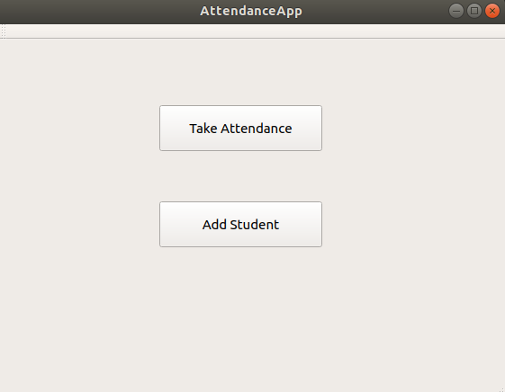
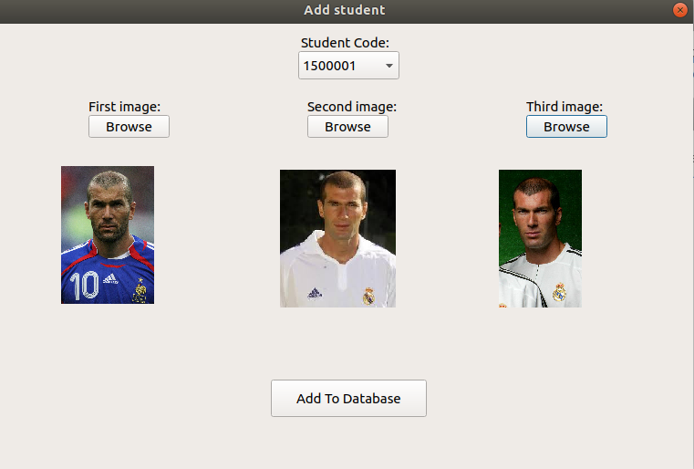
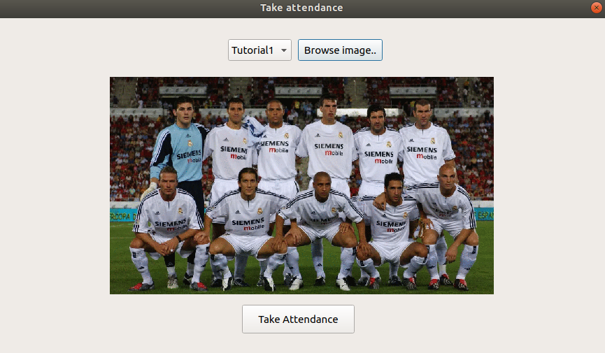
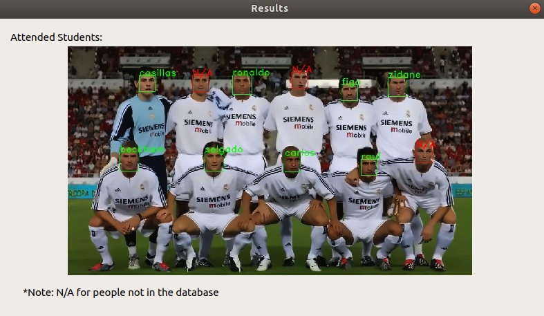

# GUI details 
## this application Consist of 4 windows :

## Main window :
    this window is the main window of the application . It contains 2 buttons to add new student to the students database or take the attendance of a session

    
    

## New Student Window :
    this window have the function of adding new student to the database by choosing 3 images and the code of this student 

    
    

## Take attendence Window :
    through this window , you can choose an image that contain 10 to 15 students to take their attendance 

    
    

## Result Window :

    
    

# Instruction to reun the app :
    1.  go to the build directory 
    2.  open terminal
    3.  type ./AttendanceApp

